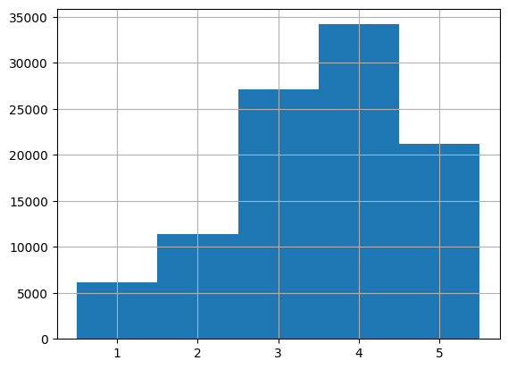

# Introduction
Recommendation systems are crucial for recommending relevant products and content to users on platforms 
like Netflix and Amazon. In this project, I develop and evaluate a movie recommendation system for the popular 
MovieLens 100K dataset.

# Data Analysis
The MovieLens 100K dataset contains 100,000 ratings by 943 users for 1682 movies. The ratings are on a scale of 1 to 5. 
Each user has at least 20 ratings. Data is split into training (90%) and test (10%) sets for model validation. 
Distribution of ratings is shown below:

Also, in the dataset was some missing values in the movies and genres tables.
The dataset spans genres like drama, comedy, action and romance which allows training genre-based recommendation models. 
The sparsity of user-movie rating matrix poses challenge for collaborative filtering methods.

# Model Implementation

I employ a basic K-Nearest Neighbors recommendation algorithm from [Surprise library](https://surprise.readthedocs.io/en/stable/index.html). 
It is based on finding similar users and recommending movies that they have rated highly.
You can find class for recommender system in /src/recsys/recommender.py. This class contains RecSys implementation 
and implements such methods:

* Recommend top-n movies for user by predicted rating
* Recommend top-n movies for user with small number of ratings using most popular movies
* Return the most popular films
* Return of the user's favorite movies
* Return of the user's favorite genres

The advantages and disadvantages of my recommendation system are:

## Advantages
* Simple and fast to predict
* Captures complex patterns from nearest neighbor data points
* Supports new users
* Return the statistics

## Disadvantages
* Library doesn't support incremental training and I need to retrain model after several iterations
* Prone to overfitting for sparse matrices
* More data needed for meaningful similar users
* Computationally expensive on huge datasets

# Training Process
I first grid searched optimal K hyperparameter on subset with 5-fold cross validation optimizing 
for Precision, Recall and NDCG. 

This setup K = 24 and min_k = 2 was best across metrics. I retrained final model on full train data 
with these best params.

I saved the model file for reload, so we need not retrain each time.

# Evaluation
For robust evaluation, 5-fold cross validation was used with train-test splits preserving user distribution. Testing on unseen user ratings prevents overfitting.

These metrics were tracked for model selection and evaluation:

- Precision@5: Relevant items in top 5 recs
- Recall@5: % relevant items recommended
- NDCG@5: Score accounting for item order
I average final metrics across 5 folds to capture model generalizability.

# Results
The tuned KNN model achieved:

- Precision@5: 0.682447
- Recall@5: 0.257648
- NDCG@5: 0.893234
Good precision implies ability to return relevant personalized movies in top ranks. 

Overall the metrics indicate KNN content model provides sound movie suggestions reflecting user preferences on unseen data.

There is further headroom to enrich with metadata like movie text descriptions and improve sparsity.